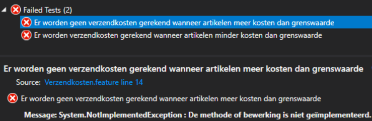
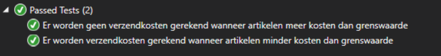

# Behavior Driven Development

## Wat is Behavior Driven Development?

### Ontstaan vanuit TDD
Behavior Driven Development (BDD) is ontstaan vanuit Test Driven Development (TDD). Binnen TDD schrijft de ontwikkelaar eerst een (falende) test, die het gewenste gedrag van een unit (class of methode) beschrijft (en controleert). Vervolgens gaat de ontwikkelaar de benodigde functionaliteit implementeren waardoor de test slaagt. Dit wordt net zolang herhaald tot alle vereiste functionaliteiten van de unit geïmplementeerd zijn en de code voldoet aan de vereiste kwaliteitseisen (re-factor).

### Verschil tussen BDD en TDD
Waar er bij TDD vanuit wordt gegaan dat de vereiste functionaliteiten (requirements) duidelijk zijn, is het doel bij Behavior Driven Development juist om deze vereisten te ontdekken en te verifiëren dat iedereen (business, testers en ontwikkelaars) de requirements op dezelfde manier interpreteert.
Daarnaast zijn unit testen over het algemeen te technisch om begrepen te worden door de business. Dat is dan ook niet het doel van de unit testen, deze zijn gemaakt om op technisch niveau te controleren of de code doet wat er verwacht wordt.

### Specifications by example
Ongeacht of er een functioneel ontwerp gemaakt wordt of User Stories, worden vereiste functionaliteiten vaak in een abstracte of conceptuele vorm beschreven. Het nadeel hiervan is dat deze beschrijvingen op verschillende manieren geïnterpreteerd kunnen worden. Zelf de best beschreven functionaliteiten kunnen doordat mensen een andere achtergrond hebben heel anders begrepen worden. Om dit te voorkomen wordt binnen de [Specifications by example](https://en.wikipedia.org/wiki/Specification_by_example) methode gebruik gemaakt van concrete voorbeelden om ideeën te beschrijven. Hierdoor zijn er veel minder verschillende interpretaties mogelijk en is de kans dat business en ontwikkelteam elkaar verkeerd begrijpen veel kleiner.

### Gherkin
Binnen BDD worden de voorbeelden beschreven binnen scenario's. Deze scenario's worden volgens een bepaald format beschreven zodat deze omgezet kunnen worden naar automatische tests. Dit format wordt de [Gherkin](https://cucumber.io/docs/gherkin/) syntax genoemd. De Gherkin parser 'vertaalt' de scenario's in code die de classes aanroept die de functionaliteit implementeren. En valideert dat deze classes het verwachte resultaat geven.

## Voorbeeld
In het onderstaande voorbeeld worden 2 scenario's beschreven voor een user story die beschrijft hoe de berekening van verzendkosten voor een webshop zou moeten werken.

``` gherkin

Functionaliteit: Verzendkosten
    Om gebruikers meerdere producten in één keer te laten bestellen
    wil ik als webshop eigenaar
    dat de verzendkosten gratis zijn als de totale prijs van de artikelen boven de grenswaarde van €10 is.

Scenario: Er worden verzendkosten gerekend wanneer artikelen minder kosten dan grenswaarde
    Stel ik heb de volgende artikelen in mijn winkelmand
        | artikel | aantal | prijs |
        | boter   |  1     | €2,00 |
        | kaas    |  1     | €7,50 |
    Als ik ga afrekenen
    Dan zijn de verzendkosten €5,00

Scenario: Er worden geen verzendkosten gerekend wanneer artikelen meer kosten dan grenswaarde
    Stel ik heb de volgende artikelen in mijn winkelmand
        | artikel | aantal | prijs |
        | boter   |  1     | €2,00 |
        | kaas    |  1     | €7,50 |
        | eieren  |  1     | €3,00 |
    Als ik ga afrekenen
    Dan zijn de verzendkosten €0,00

```

Aan de hand van deze scenario's worden _bindings_ gemaakt om de afzonderlijke statements te koppelen aan code die het mogelijk maakt om automatische testen uit te voeren. In het onderstaande voorbeeld zijn de bindings voor [SpecFlow](https://specflow.org) ([Cucumber](https://cucumber.io/) for [.NET](https://dotnet.microsoft.com/)) getoond.

``` C#
        [Given(@"ik heb de volgende artikelen in mijn winkelmand")]
        public void GegevenIkHebDeVolgendeArtikelenInMijnWinkelmand(Table table)
        {
            var items = table.CreateSet<Item>();
            shoppingCart.Items.AddRange(items);
        }
        
        [When(@"ik ga afrekenen")]
        public void AlsDeGebruikerGaatAfrekenen()
        {
            var calculator = new ShippingCostsCalculator();
            actualResult = calculator.CalculateShippingCosts(shoppingCart);
        }
        
        [Then(@"zijn de verzendkosten €(.*)")]
        public void DanZijnDeVerzendkosten(Decimal expectedResult)
        {
            Assert.Equal(expectedResult, actualResult);
        }

```

Op het moment dat de scenario's geschreven worden, zal de code nog niet geïmplementeerd zijn en zullen de testen falen.



Op het moment dat de code correct geïmplementeerd is zullen de testen slagen.



## Wat zijn de voordelen van BDD?

### Betere communicatie
Het belangrijkste doel van BDD is zorgen dat business, testers en ontwikkelaars elkaar beter begrijpen. Door functionaliteiten te beschrijven aan de hand van voorbeelden (scenario's) is er minder risico dat requirements verschillend worden geïnterpreteerd. Hierdoor begrijpen de ontwikkelaars beter wat de bedoeling is en zal over het algemeen direct het juiste gemaakt worden.

### Levende documentatie
Veel software vereist documentatie om gebruikers of beheerders te informeren over hoe het werkt. Een groot probleem van documentatie is, dat het vaak niet bijgewerkt wordt, op het moment dat de code wijzigt. Doordat de scenario's de daadwerkelijke code aanroepen en het resultaat vergelijken met de verwachte resultaten, zullen de testen falen op het moment dat de code aangepast wordt en andere resultaten geeft. Het gevolg is dat de scenario's ook aangepast moeten worden om de testen te laten slagen. En dat deze dus up-to-date blijven.

### Kans op regressie fouten verlagen
Doordat de scenario's automatische (integratie) tests vormen, is de kans op regressie fouten ook lager. Wanneer de code aangepast wordt, zullen de testen controleren of de code nog altijd voldoet aan de requirements.

### Gedeelde voorbeelden/ test scenario's
Het komt vaak voor dat gedurende software ontwikkelproces voorbeelden gegeven worden om requirements uit te leggen. Maar meestal wordt alleen de (abstract/ conceptuele) uitleg gedocumenteerd. Dit gebeurt zowel tijdens de gesprekken met stakeholders in de voorbereidingsfase als tijdens refinement sessies. Eigenlijk is dit zonde want vervolgens gaan ontwikkelaars en testers weer zelf test scenario's bedenken om te controleren of de ontwikkelde software doet wat zij verwachten. Binnen BDD (en vooral  [Specifications by example](https://en.wikipedia.org/wiki/Specification_by_example)) probeert men deze voorbeelden ook te documenteren, zodat iedereen dezelfde scenario's kan gebruiken om te controleren of de software in elk geval aan deze verwachtingen voldoet.

## Wanneer BDD gebruiken?
BDD scenario's resulteren over het algemeen in integratie tests. Integratie tests combineren over meestal meerdere units (classes/ componenten) en vergen hierdoor meestal meer setup en onderhoud. Daarom is het meestal pas interessant om BDD in te zetten bij _complexe_ logica. Alleen dan zal de extra inspanning die nodig is genoeg voordeel opleveren. Deze inspanningen zullen zich op termijn zeker wel terugverdienen aangezien de automatische testen nog lang nadat ze gemaakt zijn controleren of er geen regressie optreedt bij wijzigingen. Daarnaast worden BDD testen vaak gebruikt voor _ketentesten_ waarbij vooral gecontroleerd wordt of de verschillende systemen wel goed met elkaar blijven samenwerken.

# Meer weten?
Dit is een korte introductie over Behavior Driven Development. Uiteraard zijn er veel meer mogelijkheden en details bij de implementatie hiervan. Wilt u meer informatie hierover? Neem dan contact met ons op via telefoon: 085-0443333 of via email: [info@ifective.nl](mailto:info@ifective.nl).

#SpecificationByExample #BehaviorDrivenDevelopment #BDD #SpecFlow #Cucumber #Gherkin
